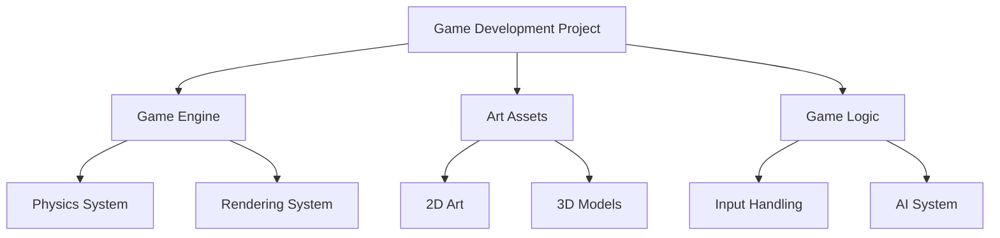

```mermaid
    graph TD;
    A[Game Development Project] --> B[Game Engine]
    A --> C[Art Assets]
    A --> D[Game Logic]
    B --> E[Physics System]
    B --> F[Rendering System]
    D --> G[Input Handling]
    D --> H[AI System]
    C --> I[2D Art]
    C --> J[3D Models]
```

**Overview**: This diagram illustrates the structure of a typical C# game development project, including the engine, art assets, and game logic dependencies.