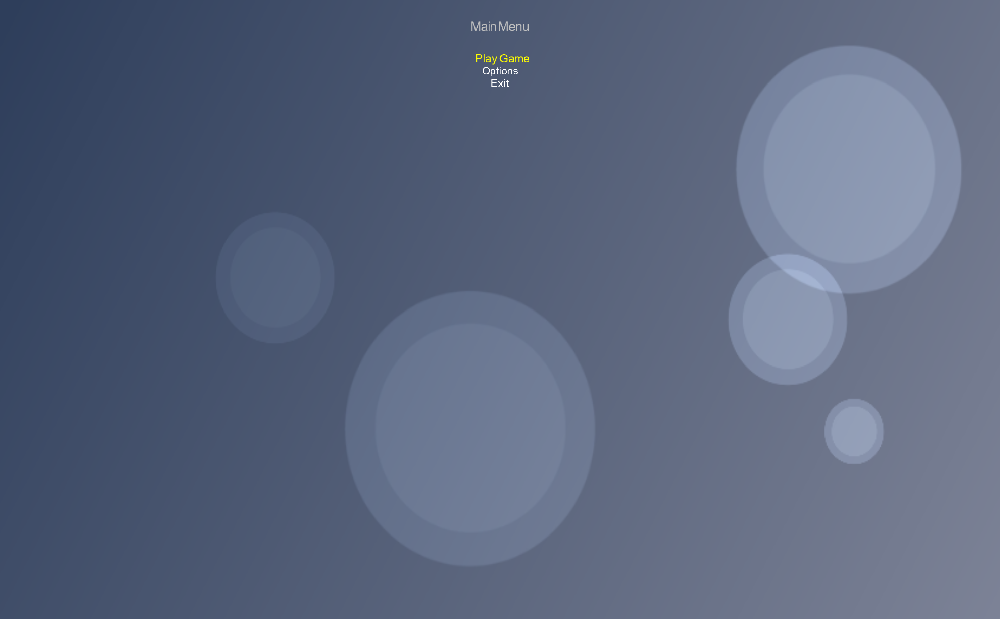
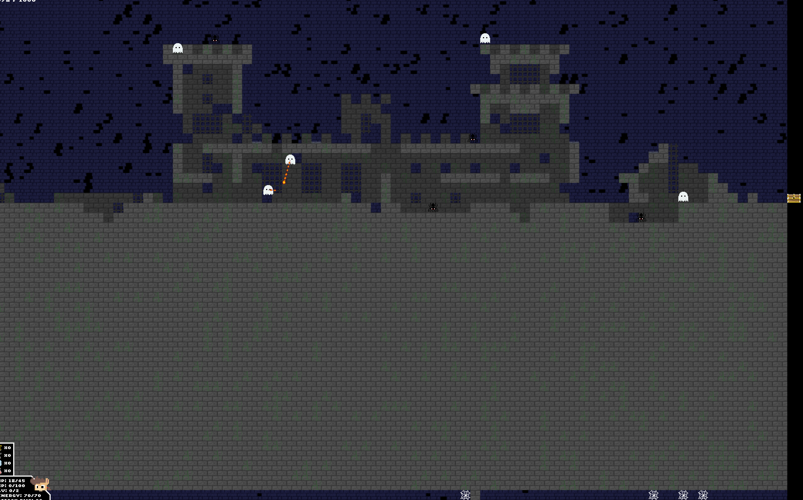

# Game-dev-refactor

A MonoGame-based desktop game project using .NET 8.0.

## Project structure

- `Menu.sln` - Visual Studio solution file
- `GameStateManagement.csproj` - main game project
- `GameMain/` - game domain, gameplay, and services
- `Screens/` and `ScreenManager/` - UI screen system
- `Content/` - game assets and MonoGame content pipeline files

## Requirements

- .NET 8 SDK
- MonoGame DesktopGL runtime
- `dotnet` CLI

## Technology stack

- .NET 8.0
- MonoGame DesktopGL
- C# for game logic and state management
- MonoGame content pipeline for asset loading
- Visual Studio / `dotnet` CLI for build and execution

## Build & run

From the repository root:

```bash
dotnet build Menu.sln
dotnet run --project GameStateManagement.csproj
```

If using Visual Studio, open `Menu.sln` and run the project.

## Images

- 
- 

## Notes

- Content assets are stored in `Content/` and loaded by the MonoGame content pipeline.
- The project uses `MonoGame.Framework.DesktopGL` and `MonoGame.Content.Builder.Task`.
